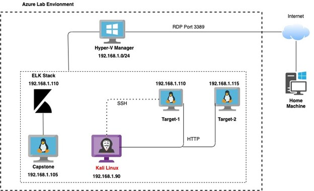

# Blue Team: Summary of Operations

## Table of Contents

1. Network Topology
2. Description of Targets
3. Monitoring the Targets
4. Patterns of Traffic & Behavior
5. Suggestions for Going Further

### Network Topology

The following machines were identified on the network:

### 1. Target 1

    Operating System: Debian GNU/Linux Version 8

    Purpose: Vulnerable Wordpress server

    IP Address: 192.168.1.110

### 2. Target 2

    Operating System: Debian GNU/Linux Version 8

    Purpose: Vulnerable to secondary attack

    IP Address: 192.168.1.115

### 3. Kali

    Operating System: Kali Linux 2020.1

    Purpose: Client to penetrate vlunerable servers

    IP Address: 192.168.1.90

    
### 4. Capstone

    Operating System: Ubuntu 18.04.1 LTS

    Purpose: Vulnerable target VM that can be used to test alerts. Forwards Filebeat, Metricbeat and Packbeat logs to the ELK server.

    IP Address: 192.168.1.105

### 5. ELK

    Operating System: Ubuntu 18.04.1 LTS

    Purpose: Deployed ELK server to collect Logs of Filebeat, Metricbeat and Packetbeat

    IP Address: 192.168.1.100

## Description of Targets

The target of this attack was: Target 1 (IP Address: 192.168.1.110).

Target 1 is an Apache web server and has SSH enabled, so ports 80 and 22 are possible ports of entry for attackers. As such, the following alerts have been implemented:

### Monitoring the Targets

Traffic to these services should be carefully monitored. To this end, we have implemented the alerts below:

1. Excessive HTTP Errors Alerts

    Metric: packetbeat

    Threshold: http.response.status_code is above 400 for the last 5 minutes

    Vulnerability Mitigated: Bruteforce Attachks, DoS Attacks, Enumeration

    Reliability: Reliability would be high since this alert would generate more true positives than false

    

2. Http Request size Monitor

    Metric: packetbeat

    Threshold: http.request.bytes is above 3500 for the last 1 minute

    Vulnerability Mitigated: Large files that being transferred, HTTP request smuggling vulnerability

    Reliability: Reliability would be medium since this alert could generate false positives. Large files could be work related

    

3. CPU Usage Monitor

    Metric: metricbeat

    Threshold: system.process.cpu.total.pct is above 0.5 for the last 5 minutes

    Vulnerability Mitigated: DoS attacks

    Reliability: Reliability would be low due to many false positives. CPU could spike when resources are being consumed due to the application needs.

    