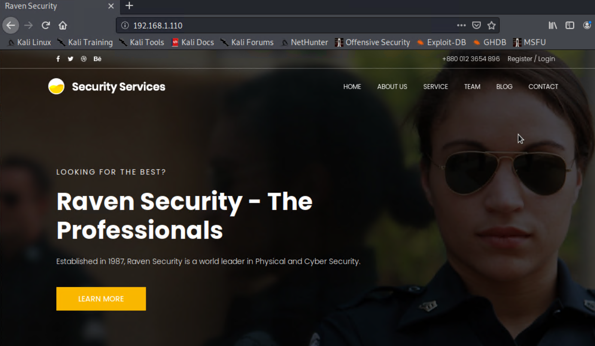

# Red Team: Summary of Operations

## Table of Contents
- Exposed Services
- Critical Vulnerabilities
- Exploitation

## The Process:

After setting up my Microsoft Azure Labs, and setting up and lauching our Final Project virtual machine, we need to find the `Target 1`  machine's IP addresses. For this, I started by running the `ifconfig` command to obtain the IP address of the target 1 machine.

- Command used: `ifconfig`

Please note that we are using the kali machine 192.168.1.90 to do the exploits/attacks.
### Exposed Services

Now that we have the Target Machine's IP; the first step is to run an `nmap` service scan to find all exposed ports and services on the network. Please find `nmap` command used as well as results below:
   
 - Command Used: `nmap 192.168.1.1/24`
 

This scan identifies the services below as potential points of entry:

- Target 1: 192.168.1.110
  - Port 22 (ssh)
  - Port 80 (http)
  - Port 111 (rpcbind)
  - Port 139 (netbios-ssn)
  - Port 445 (netbios-ssn)
Service info: Host: TARGET1; OS: Linux; CPE:/O:linux:linux_kernel

The following vulnerabilities were identified on each target:
- Target 1
  - Port 22 (ssh) - This grants us the ability to `ssh` into the target machine
  - Port 80 (http) - This allows us to access the http web server
  - Port 111 (rpcbind) - If exposed to the internet, anyone can query information without having to authenticate. It can be useful to attackers to know what you have running. It is also known as Open Network Computing Remote Procedure Call (ONC RPC). 
 
 

### Exploitation

After the `nmap` scan completed, the above ports were found open, with the above discribed vulnerabilities. 

In attempt to Enumerate the website, starting with port 80 HTTP port, I decided to type the IP address on a web browser in hopes to find some hints on access the webserver. Unfortunately, I did not get any hints. I found instead, a nice website which can be seen in the screenshot below:
    

But from the layout and design, it seemed like the target application is using some kind of CMS (Content Management System) to build the application. Knowing that it is a WordPress site, and that there is a WordPress folder, I opened the folder in a browser, a WordPress website is running from this folder but it is not a properly functional as seen below. 
    

I used a WordPress vulnerability scanner called `wpscanner` to indentify the vulnerabilities and the scan return a large amount of results. After analyzing these results, we found two usernames we can work with to try and log into the WordPress site. Please see results below
    

As seen in the above image, we can see that the two users found are: steven and michael

- Command used: `wpscan --url http://192.168.1.110/wordpress --wp-content-dir -ep -et -eu`

Rather than putting too much efford and time creating a command to crack the password for one of the users, I decided to guess it first using the most obvious guess. First we tried the user `steven` but the password was incorrect, then we tried and found out that the password for the user `michael` is `machael` (the same as the username). Below you will see that I used `ssh` and successfully gain access into `michael`s user shell:
    

 - Command used: `ssh michael@192.168.1.110`

Until this stage, we had no luck in finding any flags but since we have the user shell access, we can further look around. And in doing so, I found our first flag in the `/var/www/html` directory (folder) as seen in the screenshot below:
    

 - `flag1.txt` hash value: **flag1{b9bbcb33e11b80be759c4e844862482d}**

**Commands and exploits used**: `ls` > `cat flag1.txt` or `grep flag1 *` on its own.
   - `ls` - to list the /var/www/html directory content. This allows us to see what's in the folder.
   - `grep flag1 *` -  After finding the flag1.txt file, we use the 'grep' command to view the flag hashes. Grep could be used in absence of the above `ls` command. 

And going back one step from the html director to the `/var/www/` directory, we found the second flag `flag2` as you will see below:
    

 - `flag2.txt` hash value: **flag2{fc3fd58dcdad9ab23faca6e9a36e581c}**

**Commands and exploits used**: `cd ..` > `ls` > `cat flag2.txt`
   - `cd ..` - to go back one folder
   - `ls` - to list the `/var/www/` folder content
   - `cat flag2.txt` - to view the flag2 file content

Based on the above screenshots, we can see that we have now found two flags while in the user `michael` user shell. And we are now remaining two more flags 3 and 4.

Now we need to log in to the MySQL and dump wordPress user password hashes. As we know, WordPress was installed in the application, so let’s look for the MySQL database credentials which should be in the `wp-config.php` configuration file.
    

As you can see in the above screenshot, we found the `MySQL database password` to allow us access to log into `MySQL`

  - Command used: `cat /var/www/html/wordpress/wp-config.php`

We will now use the root username and password `R@v3nSecurity` to connect to the database as you will see below:
    

  - Command used: `mysql -u root -p` > entered password: `R@v3nSecurity`

Now that we have successfully logged in as seen above, let's check the databases available to us. Please find screenshots below:

  

- Commands used: 
  - `show databases` - used to get list of available databases
  - `use wordpress`  - used to get into the database
  - `show tables;` - to show available tables in a bit more detail

As described above, we used the above commands to list all available databases then we used `use WordPress` command to get into the databases to further check the available tables and data in a little bit more detail as you will see below:
    

As seen above, we have some tables but we are only interested in the password hashes, in this case two so let's see the `wp_users` table data as this generally will contain the passwords.
    

Per the above screenshot, we found two hashes as we needed. We already know and have exploired the user `michael's` shell. Now let's try to crack the password for user `steven`. For this we will use 'John the Ripper' tool.

But first we need to append the two user hashes into a text file. I called mine `wp_hashes.txt`. What I did was copied the two hashes, opened a separate terminal window which will brought me to the Kali root user and from their I did a `nano` command to create the hashes file. I chose this route so I wouldn't have to close or exit the MySQL database and having to log back in. 

- Command used: 
   - `nano wp_hashes.txt` - this automatically creates a file called "wp_hashes.txt" and allows me to add the hashes and format them as desired as you will see below:
    

Now that I created our "wp_hashes.txt" located in the main root account, I will go ahead and run `John Ripper` to crack the hashes and reveal the password for the user `steven`. This took some time (2-6 minutes) but we got results, see screenshot below:
    

- Commands used:
  - `john wp_hashes.txt` - to crack the hash
  - `john -show wp_hashes.txt` - to view the cracked password which is `pink84`

  As you can see above, I have successfully cracked the user `steven` password using the 'John' tool. And now I will log in with the password via `ssh`
    

Now that successfully logged in to the user `steven` as we have seen above, I poked around to see what utilities I can use to help us escalate to root. 
    

- Commands used:
   - `su steven` - used to log in to steven
   - `sudo -l` - to check for utilities I can use with sudo

AS we can see above, I found that there is python so I can use a python command to escalate to sudo as we will see below:
    

- Commands used: `sudo python -c ‘import pty;pty.spawn(“/bin/bash”);’`

Now that we have root access with the above command, we will look around for the remaining two flags. Upon successfully gaining root access, we found our fouth flag sitting right there waiting for us. I ran the following commands, and screenshot of results can be seen below:
    

- Commands used: 
  - `ls` - to view content of the present root directory
  - `cat flag4.txt` - to show the content of the file

- Flag4 hash value: **flag4{715dea6c055b9fe3337544932f2941ce}**

As we can see in the above screenshot, we have flag4. Now there is only one flag left to be found. I checked all the files and directories for the flag but I could not find anything. I finally decided to check all the database tables. But to achieve this, we first need to be in the MySQL shell, and if you remember, I previously decided to leave the already logged in MySQL terminal open and ran all the other exploits starting with the `John` tool from a fresh terminal window. Now is the payoff for that decision. And I found the third flag smartly hiding in the blog section as you will see below:
    

 
Commands used:
  - `use wordpress`  - used to get into the database
  - `show tables;` - to show available tables in a bit more detail
  - `select * from wp_posts;` - used to view the flags including the flag3 that we are looking for.

Now we have successfully revealed all four flags as you can see below:

|     Flag      |  Flag Value                      |
|:-------------:|---------------------------------:|
|  Flag 1       | b9bbcb33e11b80be759c4e844862482d |
|  Flag 2       | fc3fd58dcdad9ab23faca6e9a36e581c |
|  Flag 3       | afc01ab56b50591e7dccf93122770cd2 |
|  Flag 4       | 715dea6c055b9fe3337544932f2941ce |

