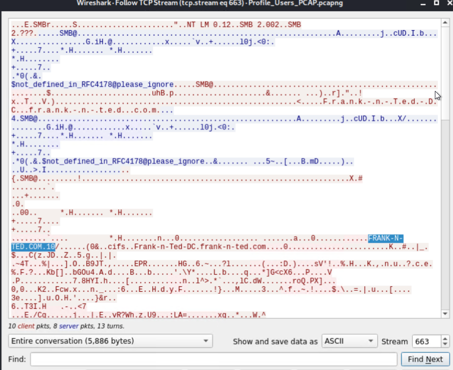
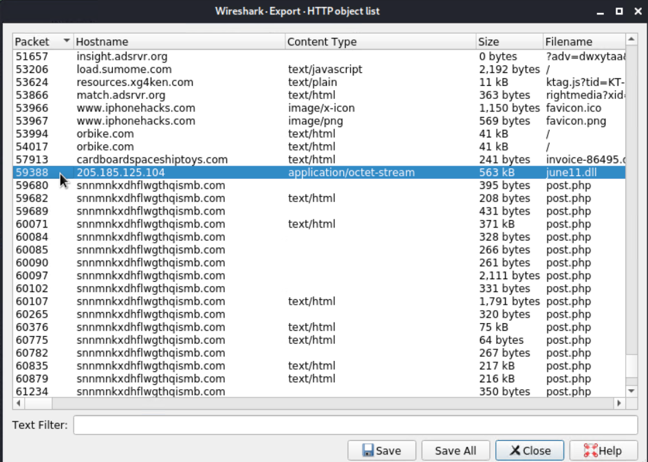
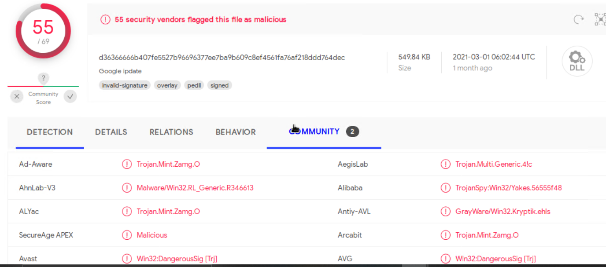

# Network Analysis

## Time Thieves
At least two users on the network have been wasting time on YouTube. Usually, IT wouldn't pay much mind to this behavior, but it seems these people have created theirown web server on the corporate network. So far, Security knows the following about
these time thieves:
1. They have set up an Active Directory network.
2. They are constantly watching videos on YouTube.
3. Their IP addresses are somewhere in the range 10.6.12.0/24.

You must inspect your traffic capture to answer the following questions:
1. What is the domain name of the users' custom site?

    FRANK-N-TED.COM - This can be seen by: click on the ip>right-click on
    ‘Transmission control>follow stream

    

2. What is the IP address of the Domain Controller (DC) of the AD network?

    10.6.12.157

3. What is the name of the malware downloaded to the 10.6.12.203 machine?

    june11.dll

    

4. What kind of malware is this classified as?

    Trojan horse

    

## Vulnerable Windows Machines

Inspect your traffic to answer the following questions:

1. Find the following information about the infected Windows machine:

    a. Host name: ROTTERDAM-PC

    b. IP address:172.16.4.205

    c. MAC address:00:59:07:b0:63:a4

2. What is the username of the Windows user whose computer is infected?

    matthijs.devries

3. What are the IP addresses used in the actual infection traffic?

    185.243.115.84

4. As a bonus, retrieve the desktop background of the Windows host.

    Bird - Seagull

    

## Illegal Downloads

IT was informed that some users are torrenting on the network. The Security team does not forbid the use of torrents for legitimate purposes, such as downloading operating systems. However, they have a strict policy against copyright infringement.

IT shared the following about the torrent activity:

1.  The machines using torrents live in the range 10.0.0.0/24 and are clients of an
AD domain.
2.  The DC of this domain lives at 10.0.0.2 and is named DogOfTheYear-DC.
3. The DC is associated with the domain dogoftheyear.net.
Your task is to isolate torrent traffic and answer the following questions:

1. Find the following information about the machine with IP address 

    a. 10.0.0.201:

    b. MAC address: 00:16:17:18:66:c8

    c. Windows username: blanco

    d. OS version: Win=winNT

2. Which torrent file did the user download?

    Betty Boop Rhythm on the Reservation.avi.torrent